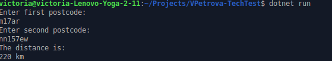
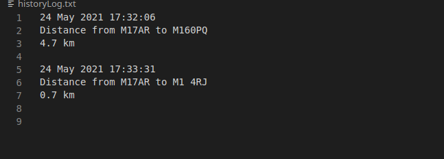

# Postcode Distance Finder

The task was to build a C# application that asks the user to provide two postcodes and then calculates the distance between them and displays them to the user.
After displaying the results the application should add the details of the search to a “historyLog.txt” file without overwriting it.

## Description

The steps taken:  

- Find an API which calculates the distance between two postcodes
- Prompt a user to input the postcodes, which are saved to variables
- Make sure that a user provides valid postcodes
- Create API helper function
- Create model for the data from API
- Return the distance from data object and display to a user
- Add method File.AppendAllText() to save the result log to historyLog.txt file. 

## Example of usage

## Example of historyLog.txt file

## Technologies

- GoogleMaps API was used to receive data because I had previously used that platform and it is very reliable and has good documentations.
- .NET Core. I have Linux operating system so .NET Core was a great solution for me.

## Author

Created by Viktoriia Petrova
